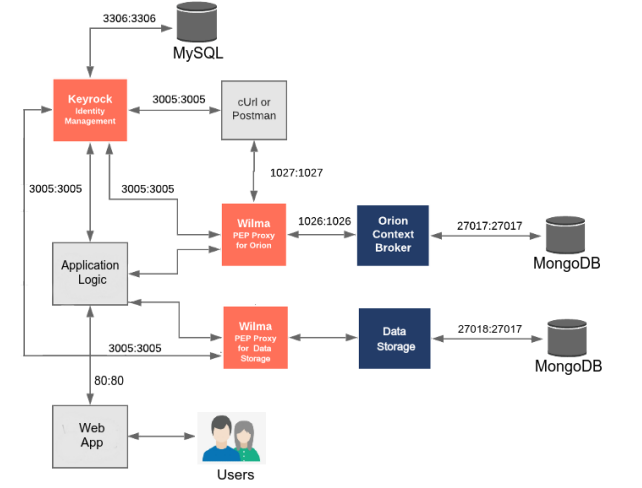
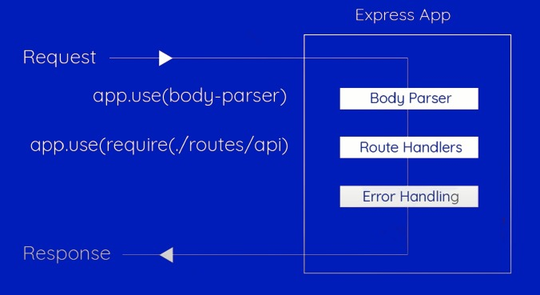

<p>

[](https://opensource.org/licenses/MIT?style=plastic) 
<a href="#!" target="_blank"></a>
<a href="#!"></a>


<a href="#!" target="_blank"></a>
<a href="#!" target="_blank"></a>

<a href="https://fiware-orion.readthedocs.io/en/master/" target="_blank"></a>
<a href="https://fiware-idm.readthedocs.io/en/latest/index.html" target="_blank"></a>
<a href="https://fiware-pep-proxy.readthedocs.io/en/latest/" target="_blank"></a>


</p>


## Description

A CinemaOwner Application using Microservices and the Docker Environment...

There are seven components:

1. Application logic
2. Identity Management
   1. [KEYROCK IDM](https://fiware-idm.readthedocs.io/en/latest/index.html)
   2. Authentication of users using OAUth2 protocol
3. Proxy
   1. [PEP PROXY - WILMA](https://fiware-pep-proxy.readthedocs.io/en/latest/)
   2. Protection of backend container- Authorization
4. Publish/Subscribe service
   1. [Orion Context Broker](https://fiware-orion.readthedocs.io/en/master/)
5. Data storage service
   1. REST API
   2. Communication between application logic and database
6. Databases
   1. MySQL 
       - User/Keyrock db
   2. mongoDB
      - Orion db
      - Application db
7. Migration to the Google Clod Platform(GCP)   


## Architecture




KEYROCK IDM :

    ▪ Container name: fiware-keyrock
    ▪ ipv4_address: 172.18.1.5
    ▪ port: 3005:3005
    ▪ Volume: mysql-db

Data storage service:

    ▪  Container name: node-mongo
    ▪  port: 27018:27018
    ▪  Volume: mongodb

   
PEP-PROXY WILMA:

    Proxy of data storage service:
        ▪ Container name: data_storage-proxy
        ▪ ipv4_address: 172.18.1.10
        ▪ port: 1027:1027


    Proxy of Orion:
        ▪ Container name: fiware-orion-proxy
        ▪ ipv4_address: 172.18.1.11
        ▪ port: 1028:1028

ORION CB:

    ▪ Container name: fiware-orion
    ▪ ipv4_address: 172.18.1.9
    ▪ port: 1026:1026
    ▪ Volume: mongo-db

VOLUMES:

    ▪ docker-project_mysql-db , MySQL db for KEYROCK
    ▪ docker-project_mongodb , mongoDB of Data Storage Service
    ▪ docker-project_mongo-db , mongoDB of Orion CB


## REST API

### Data storage service

For the creation of the data storage service, we use Node.js with the Express framework. Below we can see the structure of API:



Routes/Endpoints of REST API's calls

    ▪ http://ipV4:port/api/subscriptions
    ▪ http://ipV4:port/api/movies
    ▪ http://ipV4:port/api/favorites  

## Running

For running my project:
   1. Clone the repo ```https://github.com/NikolasTz/CinemaOnwerApp.git```
   2. Enter the directory ```cd docker_project```
   3. Migration of the databases
   4. Run ```docker-compose up --build```
   5. Visit the ``locahost:8080``
